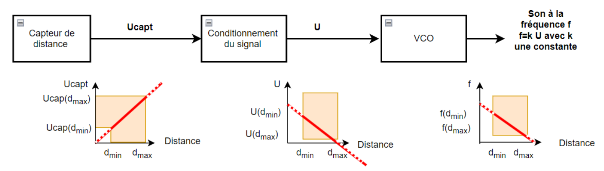

# Rapport du projet "Radar de recul" 2024

## I - Introduction
Le but de ce projet est de nous familiariser avec le fonctionnement des AOP au travers de la création d'un système de radar de recul sonore, en effet il s'agit de moduler la fréquence d'un signal traingulaire en sortie en fonction de la distance mesurée par le capteur à ultrasons en entrée.

Pour répondre à cette problématique nous avons décomposer le système en deux sous blocs :
* Le Conditionneur
* Le VCO (oscillateur commandé en tension)

## II - Présentation du matériel

1) Capteur *MB1030 LV-MaxSonar-EZ3* : Il utilise des ondes ultrasonores pour mesurer la distance jusqu'à un objet.

    

2) 4 × AOP *TL081* : ils seront tous alimentés de manière symétrique avec $Vcc_{+} = 15.0V$ et $Vcc_{-} = -15.0V$
3) Transistor *2N7000*

    

4) Condensateur 15nF
5) Résistances
6) Fils de connexion
7) Multimètre
8) Générateur de tension continu (alimentation parallèle)
9) Oscilloscope

## III - Conditionneur
Après nous être dans un premier temps tourné vers un circuit du type "*amplificateur inverseur*" couplé à un "*sommateur*", bien que ce dernier fournissait bien le résultat escompté, on s'est rendu compte qu'il y avait plus simple que d'utiliser deux AOP.

    

    

On a finalement décidé d'utiliser un circuit "*amplificateur inverseur ET sommateur*".

On obtient donc le schéma suivant :

    

On a les équations suivantes :
* $V^+ = \frac{15}{24.8}$
* Potentiel des noeuds en $V-$ :

$$ \frac{Ve-V^-}{R7}+\frac{Vs-V^-}{R8}=0 $$

$$ \frac{Ve}{R7}+\frac{Vs}{R8}=V^+\cdot\frac{R7+R8}{R7 \cdot R8} $$

$$ \frac{Vs}{R8}=V^+\cdot\frac{R7+R8}{R7 \cdot R8}-\frac{Ve}{R7} $$

$$ Vs=V^+\cdot\frac{R7+R8}{R7}-\frac{R8}{R7} \cdot Ve $$

$$ Vs=2.24-2.7 \cdot Ve $$

## IV - Étude des différents blocs élémentaires qui constituent le VCO

### 1. Étude du bloc fonctionnel n°1 :

    

On recherche les équations de fonctionnement de ce système :
* $V^-=V_{s_3}$
* Potentiel des noeuds en $V+$ :

$$ -\frac{V^+}{R4}+\frac{V_{s_1}-V^+}{R5}=0 $$

$$ \frac{V_{s_1}}{R5}=V^+ \cdot \left( \frac{1}{R4} + \frac{1}{R5} \right) $$

$$ \frac{V_{s_1}}{R5}=V^+ \cdot \frac{R4+R5}{R4 \cdot R5} $$

$$ V^+ = V_{s_1} \cdot \frac{R4}{R4 + R5} $$

D'où $\epsilon = V_{s_1} \cdot \frac{R4}{R4 + R5} - V_{s_3}$

$$ \epsilon > 0 \Leftrightarrow V_{sat_+}\cdot \left( \frac{R4}{R4+R5} \right) > V_{s_3} $$

$$ \epsilon < 0 \Leftrightarrow V_{sat_-}\cdot \left( \frac{R4}{R4+R5} \right) < V_{s_3} $$

On peut donc affirmer que les deux tensions seuil sont les suivantes :

$$ V_{seuil_1} = V_{sat_-}\cdot \left( \frac{R4}{R4+R5} \right) $$
$$ V_{seuil_2} = V_{sat_+}\cdot \left( \frac{R4}{R4+R5} \right) $$

Étant donné que l'on a trouvé un résultat plus que satisfaisant avec $R5 = 1k \Omega$ et $R4 = 1.61k \Omega$, on a donc nos deux seuils qui sont égaux à :

$$  V_{seuil_1} = -15V \cdot \left( \frac{1.61}{1.61+1} \right) = -9.25V  $$
$$ V_{seuil_2} = 15V\cdot \left( \frac{1.61}{1.61+1} \right) = 9.25V $$

La relation recherchée entre $R4$ et $R5$ est donc la suivante :

$$ \frac{R4}{R4+R5} = \frac{1.61}{2.61} $$

Par conséquent, en fixant arbitrairement $R4$, on peut déterminer $R5$ aisément :

$$ R5 = \left( \frac{R4 \times 2.61}{1.61} \right) - R4 $$

### 2. Étude du bloc fonctionnel n°2 :

    

Ici on va distinguer deux cas :
* Le transistor commute de telle sorte que l'entrée non inverseuse l'AOP U1 correspond à $V_{e_2}$ c'est à dire $V_{eTRAN} = V_{e_2}$
* Le transistor commute de telle sorte que l'entrée non inverseuse l'AOP U1 correspond à la masse c'est à dire $V_{eTRAN} = 0$

Commençons donc par le premier cas :

* $V_+ = V_{e_2}$
* Potentiel des noeuds en $V_-$ :

$$ \frac{V_{e_2} - V_-}{R2} + \frac{V_{s_2}-V_-}{R3} =0 $$

$$ V_- \cdot \left( \frac{1}{R2}+\frac{1}{R3}\right) = \frac{V_{e_2}}{R2}+\frac{V_{s_2}}{R3} $$

$$ V_{e_2} \cdot \left( \frac{1}{R2} + \frac{1}{R3}\right) - \frac{V_{e_2}}{R2} = \frac{V_{s_2}}{R3} $$

$$ \frac{V_{e_2}}{R3} = \frac{V_{s_2}}{R3} $$

Par conséquent à **l'état haut** on a $V_{e_2} = V_{s_2}$

Si l'on s'intéresse maintenant à **l'état bas** :
* $V_+ = 0$
* Potentiel des noeuds en $V_-$ :

$$ \frac{V_{e_2} - V_-}{R2} + \frac{V_{s_2}-V_-}{R3} =0 $$

$$ \frac{V_{e_2}}{R2}+\frac{V_{s_2}}{R3} = 0 $$

$$ \frac{V_{s_2}}{R3} = -\frac{V_{e_2}}{R2} $$

$$ V_{s_2} = -\frac{R3}{R2} \cdot V_{e_2} $$

On rappelle que l'on cherche à avoir en sortie un signal carré, périodique et symétrique par rapport à 0. Au vu des équations que nous venons de déterminer il est nécessaire de choisir $R3=R2$, de cette façon nous aurons $V_{s_2} = V_{e_2}$ à **l'état haut** et inversement $V_{s_2} = -V_{e_2}$ à **l'état bas**.

Dans toute la suite du projet on définira donc $R3=R2$.

C'est bien ce que l'on retrouve en simulation :

    

### 3. Étude du bloc fonctionnel n°3 :
Il s'agit d'un montage à AOP avec un condensateur dans la boucle de rétroaction.

    

L'expression littérale du courant $i(t)$ circulant dans le condensateur est : $i(t) = \frac{V_{s_2}}{R6}$

$$ \frac{V_{s_2}}{R6} = C \cdot \overset{\circ}{V_c(t)} $$

$$ \Leftrightarrow \overset{\circ}{V_c(t)} = \frac{V_{s_2}}{R6 \cdot C} $$

$$ \Leftrightarrow V_c(t) = \int \frac{V_{s_2}}{R6 \cdot C} dt $$

$$ \Leftrightarrow V_c(t) = \frac{V_{s_2}}{R6 \cdot C} \cdot t $$

On sait aussi que $V_{s_3}(t) = - V_c(t)$. Par exemple avec $V_{s_2} = 2V$ on obtient une pente de $-\frac{V_{s_2}}{C\cdot R6}\cdot t=-\frac{2}{(15\times10^{-9})\times18000} \cdot t=-7407t$ ou bien encore avec $V_{s_2} = -1V$ on obtient une pente de $-\frac{-1}{(15\times10^{-9})\times18000} \cdot t=3703t$.

Ces résultats sont très intéressant car en connaissant la pente que l'on veut obtenir sur le signal de sortie du VCO on peut dimensionner de manière très fidèle $R6$ :

$$ R6=\frac{V_{s_2}}{C \times pente} $$

Ce qui correspond bien aux mesures en simulation :
* Avec $V_{s_2} = 2V$ :

    

* Avec $V_{s_2} = -1V$ :

    

### V - Retour d'expérience
Nous avons identifié les résistances permettant de jouer sur l'amplitude ($R4$) et la fréquence du signal de sortie ($R6$), nous avons donc décidé de faire varier ces valeurs de résistance en utilisant des potentiomètres de $10k\Omega$.

### VI - Résultat final
Après avoir câblé complètement le montage, on obtient le résultat suivant :

    

    

Pour $D_{min} = 20cm$ soit une tension d'entrée continue de $0.074V$ le signal en sortie affiché sur l'oscilloscope est le suivant :

    

Pour $D_{max} = 150cm$ soit une tension d'entrée continue de $0.575V$ le signal en sortie affiché sur l'oscilloscope est le suivant :

    

