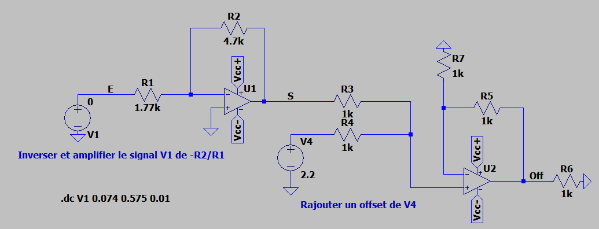
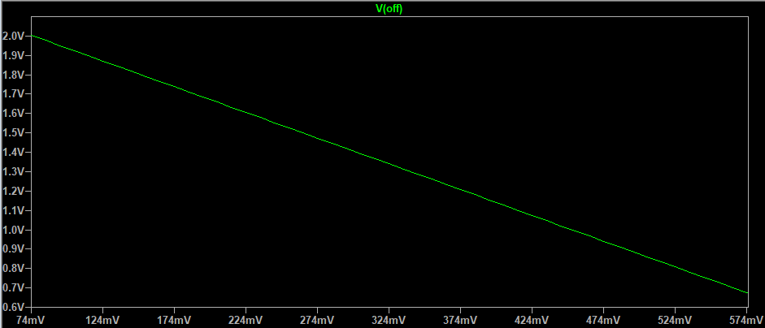
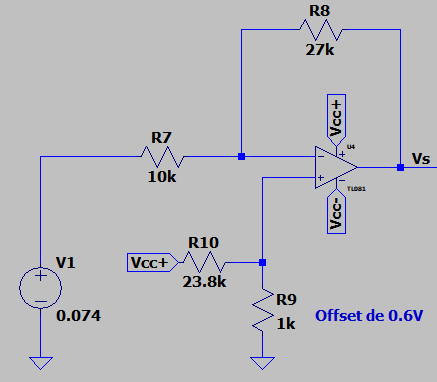
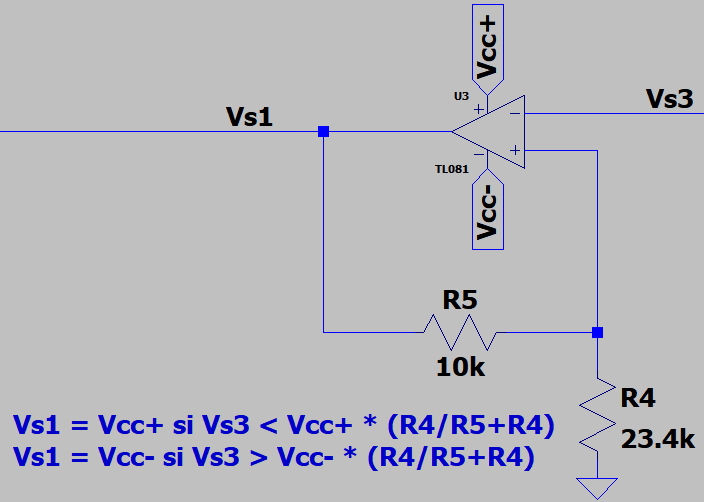
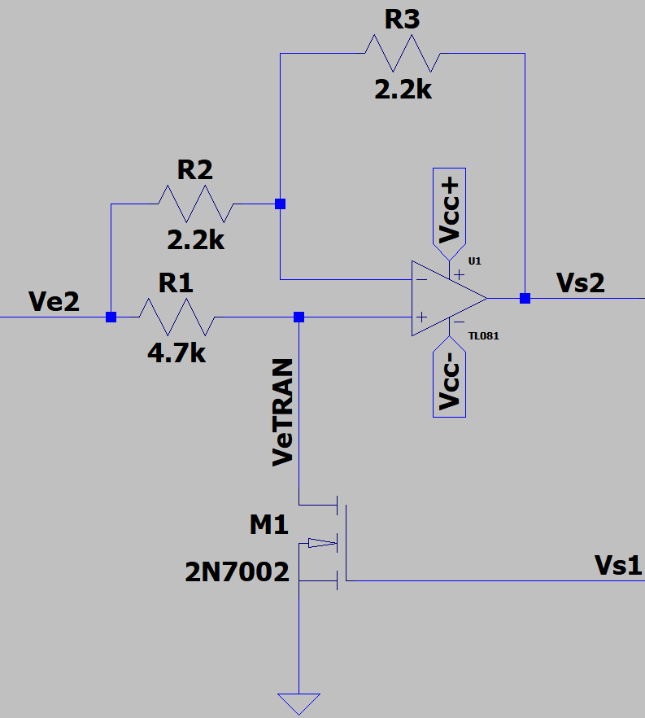
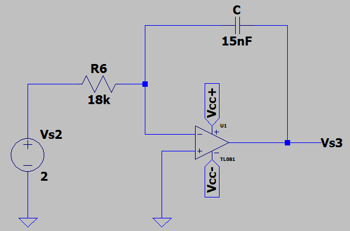
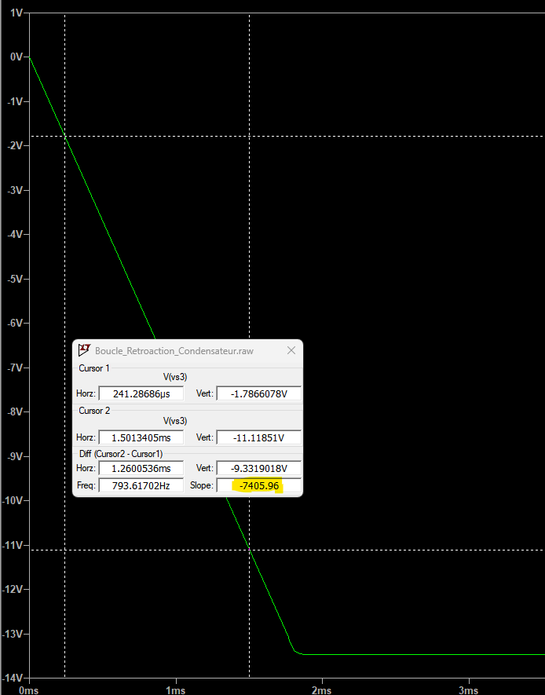
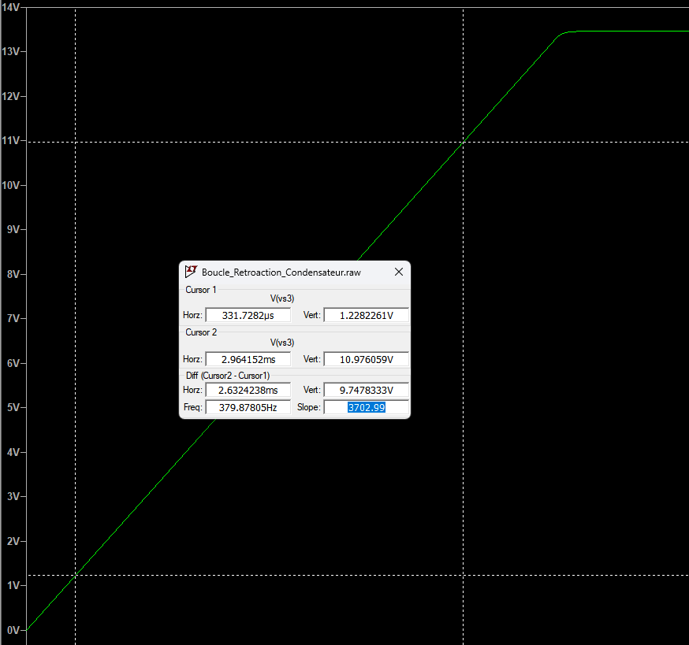

# Rapport du projet "Radar de recul" 2024

## I - Introduction
Le but de ce projet est de nous familiariser avec le fonctionnement des AOP au travers de la création d'un système de radar de recul sonore, en effet il s'agit de moduler la fréquence d'un signal traingulaire en sortie en fonction de la distance mesurée par le capteur à ultrasons en entrée.

Pour répondre à cette problématique nous avons décomposer le système en deux sous blocs :
* Le Conditionneur
* Le VCO (oscillateur commandé en tension)

## II - Présentation du matériel

1) Capteur *MB1030 LV-MaxSonar-EZ3* :
2) 4 * AOP *TL081*
3) Transistor *2N7000*
4) Condensateur 15nF
5) Résistances
6) Fils de connexion
7) Multimètre
8) Générateur de tension continu (alimentation parallèle)
9) Oscilloscope

## III - Conditionneur
Après nous être dans un premier temps tourné vers un circuit du type "*amplificateur inverseur*" couplé à un "*sommateur*", bien que ce dernier fournissait bien le résultat escompté, on s'est rendu compte qu'il y avait plus simple que d'utiliser deux AOP.

On a finalement décidé d'utiliser un circuit "*amplificateur inverseur ET sommateur*".

On obtient donc le schéma suivant :

On a les équations suivantes :
* $V^+ = \frac{15}{24.8}$
* Potentiel des noeuds en $V-$ :

$$ \frac{Ve-V^-}{R7}+\frac{Vs-V^-}{R8}=0 $$

$$ \frac{Ve}{R7}+\frac{Vs}{R8}=V^+\cdot\frac{R7+R8}{R7 \cdot R8} $$

$$ \frac{Vs}{R8}=V^+\cdot\frac{R7+R8}{R7 \cdot R8}-\frac{Ve}{R7} $$

$$ Vs=V^+\cdot\frac{R7+R8}{R7}-\frac{R8}{R7} \cdot Ve $$

$$ Vs=2.24-2.7 \cdot Ve $$

## IV - Étude des différents blocs élémentaires qui constituent le VCO

### 1. Étude du bloc fonctionnel n°1 :

On recherche les équations de fonctionnement de ce système :
* $V^-=V_{s_3}$
* Potentiel des noeuds en $V+$ :

$$ -\frac{V^+}{R4}+\frac{V_{s_1}-V^+}{R5}=0 $$

$$ \frac{V_{s_1}}{R5}=V^+ \cdot \left( \frac{1}{R4} + \frac{1}{R5} \right) $$

$$ \frac{V_{s_1}}{R5}=V^+ \cdot \frac{R4+R5}{R4 \cdot R5} $$

$$ V^+ = V_{s_1} \cdot \frac{R4}{R4 + R5} $$

D'où $\epsilon = V_{s_1} \cdot \frac{R4}{R4 + R5} - V_{s_3}$

$$ \epsilon > 0 \Leftrightarrow V_{sat_+}\cdot \left( \frac{R4}{R4+R5} \right) > V_{s_3} $$

$$ \epsilon < 0 \Leftrightarrow V_{sat_-}\cdot \left( \frac{R4}{R4+R5} \right) < V_{s_3} $$

On peut donc affirmer que les deux tensions seuil sont les suivantes :

$$ \left\{ \begin{array}{rcl} V_{seuil_1} = V_{sat_-}\cdot \left( \frac{R4}{R4+R5} \right) \\  V_{seuil_2} = V_{sat_+}\cdot \left( \frac{R4}{R4+R5} \right) \end{array} \right\}$$

### 2. Étude du bloc fonctionnel n°2 :

Ici on va distinguer deux cas :
* Le transistor commute de telle sorte que l'entrée non inverseuse l'AOP U1 correspond à $V_{e_2}$ c'est à dire $V_{eTRAN} = V_{e_2}$
* Le transistor commute de telle sorte que l'entrée non inverseuse l'AOP U1 correspond à la masse c'est à dire $V_{eTRAN} = 0$

Commençons donc par le premier cas :

* $V_+ = V_{e_2}$
* Potentiel des noeuds en $V^-$ :

$$ \frac{V_{e_2} - V^-}{R2} + \frac{V_{s_2}-V^-}{R3} =0 $$

$$ V^- \cdot \left( \frac{1}{R2}+\frac{1}{R3}\right) = \frac{V_{e_2}}{R2}+\frac{V_{s_2}}{R3} $$

$$ V^- \cdot  \frac{R3+R2}{R2 \cdot R3} = \frac{V_{e_2} \cdot R3 + V_{s_2} \cdot R2}{R2 \cdot R3} $$

$$ V^- = \frac{V_{e_2} \cdot R3+V_{s_2} \cdot R2}{R2 + R3} $$

D'où $ \epsilon = V_e - \frac{V_{e_2} \cdot R3+V_{s_2} \cdot R2}{R2 + R3} $

On peut donc conclure pour le second cas que : $ \epsilon = - \frac{V_{e_2} \cdot R3+V_{s_2} \cdot R2}{R2 + R3} $

### 3. Étude du bloc fonctionnel n°3 :
Il s'agit d'un montage à AOP avec un condensateur dans la boucle de rétroaction.

L'expression littérale du courant $i(t)$ circulant dans le condensateur est : $i(t) = \frac{V_{s_2} - V_{s_3}(t)}{R6}$
$$\frac{V_{s_2} - V_{s_3}(t)}{R6} = C \cdot \overset{\circ}{V_c(t)}$$
$$\Leftrightarrow \overset{\circ}{V_c(t)} = \frac{V_{s_2} - V_{s_3}(t)}{R6 \cdot C}$$

On sait aussi que $V_{s_3}(t) = - V_c(t)$. Par exemple avec $V_{s_2} = 2V$ on obtient une pente de $-\frac{V_{s_2}}{C\cdot R6}\cdot t=-\frac{2}{(15\times10^{-9})\times18000} \cdot t=-7407t$ ou bien encore avec $V_{s_2} = -1V$ on obtient une pente de $-\frac{-1}{(15\times10^{-9})\times18000} \cdot t=3703t$.

Ce qui correspond bien aux mesures en simulation :
* Avec $V_{s_2} = 2V$ :

* Avec $V_{s_2} = -1V$ :

